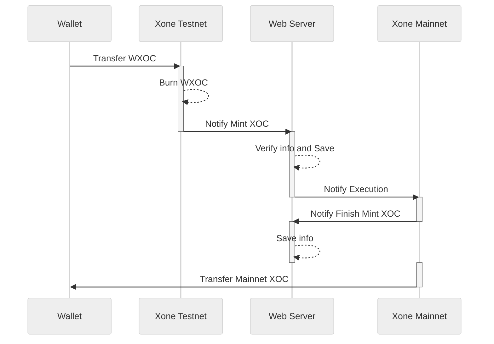

import { Steps, Callout } from 'nextra/components';
import {Card, CardHeader, CardBody, CardFooter, Divider, Link, Button} from "@nextui-org/react";
import {Table, TableHeader, TableColumn, TableBody, TableRow, TableCell} from "@nextui-org/react";
import ContactInfo from "@/components/ContactInfo";
import Image from 'next/image';


# Welcome to the XOC Release Page!

This guide will help you quickly understand why you need to release XOC and how to complete the process smoothly.

## Why Release XOC?

XOC is the native token of the Xone blockchain, while WXOC (Wrapped XOC) is a mapped token used for interactions on the Xone Testnet. To use XOC on the Xone Mainnet, you need to exchange WXOC for XOC. According to the XOC token economy model, donated users receive WXOC tokens and acquire them linearly based on a planned ratio. This process is called "Release."

## How Do I Proceed?  

<Steps>
### Step 1: Access the Release Page.

Visit the Xone XOC Release Page to start the process of releasing your XOC. <Link className='text-primaryHue' isExternal showAnchorIcon href="https://xone.org/release">Get started now</Link>

<Image src="/images/Release_Banner.png" alt="Release_Banner" width={1200} height={800} layout="responsive" />

### Step 2: Connect Your Wallet and Check.

Connect your wallet that holds WXOC tokens to our release page. Before proceeding, ensure that your connected wallet contains WXOC tokens available for interaction and sufficient gas fees.

<Image src="/images/Release_Connect_Wallet.png" alt="Release_Connect_Wallet" width={1200} height={800} layout="responsive" />

<Button
  href="https://faucet.xone.org/"
  as={Link}
  download
  className="top-6 rounded-md bg-primaryHue px-3.5 py-2.5 text-sm font-semibold text-white shadow-sm hover:bg-grd-500 focus-visible:outline focus-visible:outline-2 focus-visible:outline-offset-2"
  showAnchorIcon
  variant="solid"
>
  No gas fees? Claim here >>
</Button>

### Step 3: Customize the Release Amount.

Once the previous steps are confirmed, enter the amount of XOC you want to release and confirm the transaction. Your wallet will prompt a transaction confirmation request—please verify the contract address and transaction details before proceeding.

<Image src="/images/Release_Send_WXOC.png" alt="Release_Send_WXOC" width={1200} height={800} layout="responsive" />

<Callout type="warning" emoji="⚠️">
  **Note:**  
  1. The exchange ratio of WXOC to XOC is **1:1**, with no additional fees or management charges.  
  2. The amount of XOC you receive depends on the amount of WXOC you confirm for release. <Link className='text-primaryHue' showAnchorIcon href="/study/release#how-do-i-calculate-the-tokens-i-can-release">Check the calculation details here >></Link>
  3. Once your WXOC tokens are sent and confirmed on the contract, they **cannot be retrieved**, whether sent from this page or through other methods.
</Callout>

### Step 4: Wait for Xone Mainnet Confirmation and Check.

After successfully sending WXOC to the Xone Testnet contract address, the Mainnet contract will begin verification. Once confirmed, your Mainnet wallet address will receive the corresponding amount of XOC tokens. Please switch to **Xone Mainnet** to check your balance.

</Steps>

## About the Release Mechanism

You may still be unsure about how the release mechanism works. Below, we provide an illustrated explanation of the Xone donation plan's token distribution and release mechanism.



You might still have many questions about the illustration. Let’s dive deeper into the process:  

1. **Sending WXOC to the Xone Testnet Contract**  
  After the **Xone Mainnet launch**, you need to send the WXOC tokens you received from donations to the **Xone Testnet contract address**. Once the contract receives your tokens, it will **burn** them and record key information such as **amount, address, and timestamp** on the server.  

  🚨 *This step is crucial as it determines the amount of XOC you will receive on the Xone Mainnet.*  

2. **Data Verification & Locking**  
  The server **stores and verifies** the transaction data. After confirmation, it **notifies Xone Mainnet** to proceed with the XOC release. At this stage, the Testnet transaction details are officially recorded on the Mainnet, a process referred to as **locking** on the release page. Your XOC tokens will then be released **linearly** based on these records.  

3. **Gradual Release of XOC**  
  According to the rules, the contract on **Xone Mainnet** will **start releasing XOC** to the wallet address that interacted with the Testnet. The release follows a **linear schedule**, where tokens unlock **every Epoch after 50 Epochs**.  
  
  🎉 *Once the process begins, your XOC tokens will be gradually sent to your wallet!*

## How do I calculate the tokens I can release?

Before we start calculating, let's understand <Link className='text-primaryHue' showAnchorIcon href="/study/epoch">what Xone Epoch is?</Link>Here, we assume that the first Epoch will be released when the mainnet is launched, so there will be 365 Epochs participating in this release in two years. Since we have to wait for 50 Epochs after the first release, the total number of released Epochs is 315.

Although we calculate the accumulated number of Epochs based on the number of natural days in 2 years, it is not fixed.

It may be adjusted due to market fluctuations, foundation voting, etc., **but you can be sure that the release cycle of the total number of donated tokens will remain unchanged, the release will be settled based on Epochs unchanged, and the number of XOC you can obtain will remain unchanged**.

After a deeper understanding, now imagine a value that represents the number of WXOC tokens you get in the donation plan. For example: 10,000.00

Preparation is complete! Next, let's take a look at the number of XOCs released this time; from the <Link className='text-primaryHue' showAnchorIcon href="/study/wiki">Xone white paper</Link>, we can know that the XOC released is the donation part, which accounts for 10% of the total token supply, that is: 1,000,000,000.00. 5% will be released when the mainnet is launched, so on the first day, 50,000,000.00 XOC will be released for the donation plan.

<div className="overflow-x-auto">
```math
50{,}000{,}000 = 1{,}000{,}000{,}000 \times 5\%
```
</div>

Next, we will combine the values ​​of the two donations 😊

<div className="overflow-x-auto">
  <Table key={new Date().getTime()} removeWrapper aria-label="XOC Fundraising Table" className="mt-2">
    <TableHeader>
      <TableColumn key="mode">Mode</TableColumn>
      <TableColumn key="time">Time</TableColumn>
      <TableColumn key="tokens">Number of Tokens(XOC)</TableColumn>
      <TableColumn key="price">Price<span>($)</span></TableColumn>
      <TableColumn key="fundraising">Fundraising(USDH)</TableColumn>
    </TableHeader>
    <TableBody>
      <TableRow key="1">
        <TableCell>Private placement</TableCell>
        <TableCell>2024-11-11～2024-12-01</TableCell>
        <TableCell>40,000,000.00</TableCell>
        <TableCell>0.05</TableCell>
        <TableCell>2,000,000.00</TableCell>
      </TableRow>
      <TableRow key="2">
        <TableCell>Public Offering</TableCell>
        <TableCell>2024-12-11~2025-01-19</TableCell>
        <TableCell>300,000,000.00</TableCell>
        <TableCell>0.15</TableCell>
        <TableCell>45,000,000.00</TableCell>
      </TableRow>
    </TableBody>
  </Table>
</div>

Finally, we see that the total number of tokens required for donation release is 340,000,000.00.

At this point, we pass the donation plan rules; after the Xone Mainnet goes online, the number of tokens available for donors to release in the first Epoch is: 17,000,000.00 XOC.

<div className="overflow-x-auto">
```math
17{,}000{,}000=340{,}000{,}000 \times 5\%
```
</div>

Then you can finally release in the first Epoch:

<div className="overflow-x-auto">
```math
Release=Lock_{Token} \times 5\%
```
</div>

In the above content, we assumed that you got 10,000.00 WXOC, then through calculation, you can immediately get 500.00 XOC released on Xone Mainnet.

<Callout type="warning" emoji="⚠️">
  **Release:** The amount of XOC you can get.\
  **LockWXOC:** The total amount you send to the Xone Testnet contract before the next release point. This value will be eliminated every time you successfully release.
</Callout>

So how much can be released after 50 Epochs? Let’s continue to calculate; in the previous content, we mentioned that the total amount of the donation plan needs to be released and the total amount of tokens accumulated in the two donation phases. Therefore, we can deduce that each can be released:

<div className="overflow-x-auto">
```math
Each Release=\frac{TotalNumberCoins-InitialNumber}{UnpublishedEpochNumber}
```
</div>

As an individual donor, you will be determined by the amount of WXOC you have locked; therefore, you will receive:

<div className="overflow-x-auto">
```math
PersonalRelease=\frac{Lock_{Token}}{UnpublishedEpochNumber}
```
</div>

<Callout type="warning" emoji="⚠️">
  The data in the are all theoretical assumptions and do not constitute any actual investment advice.
</Callout>

<ContactInfo />